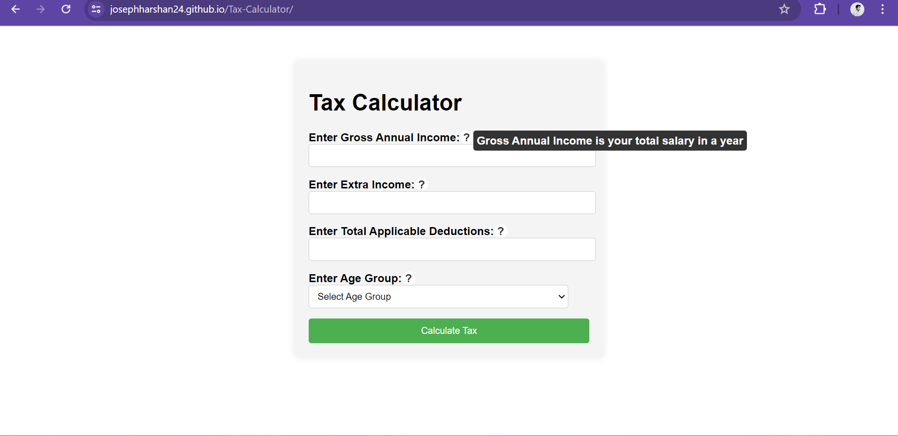
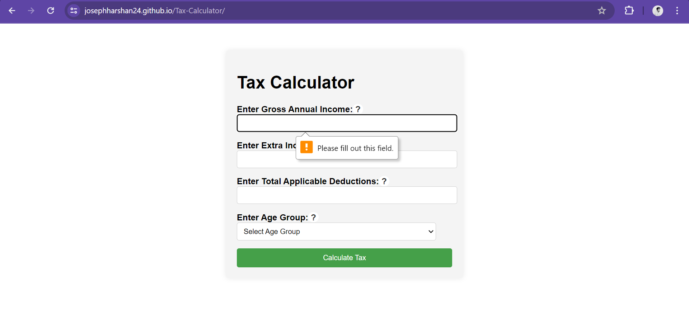
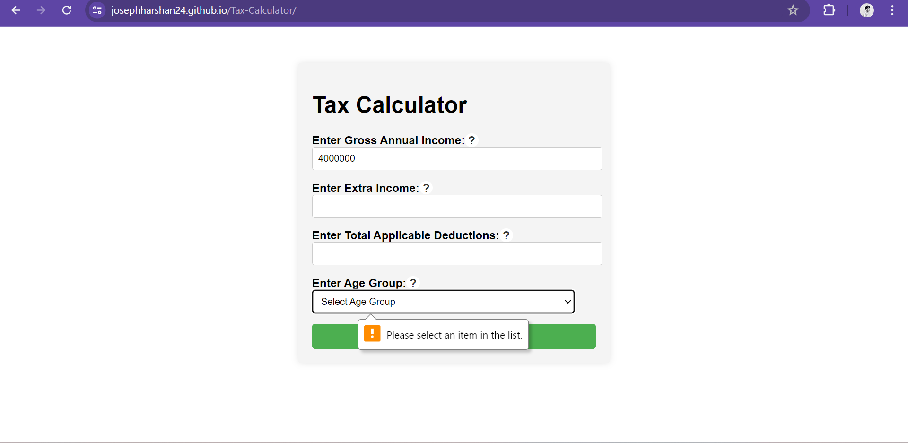
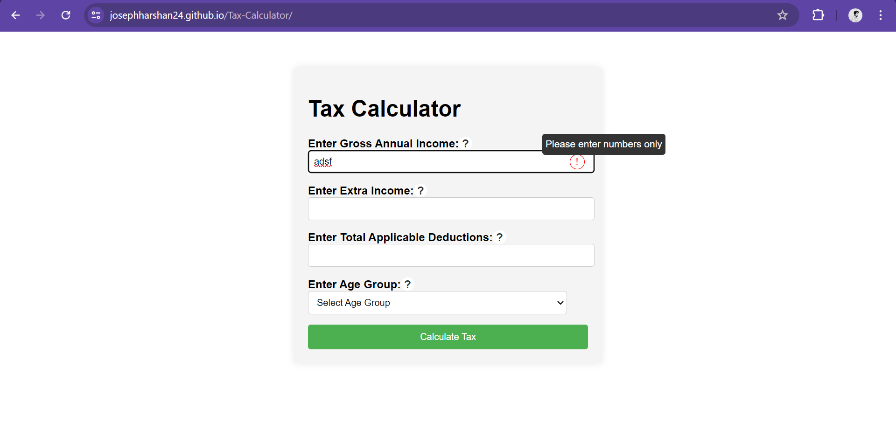
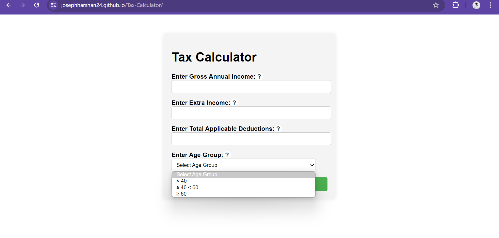
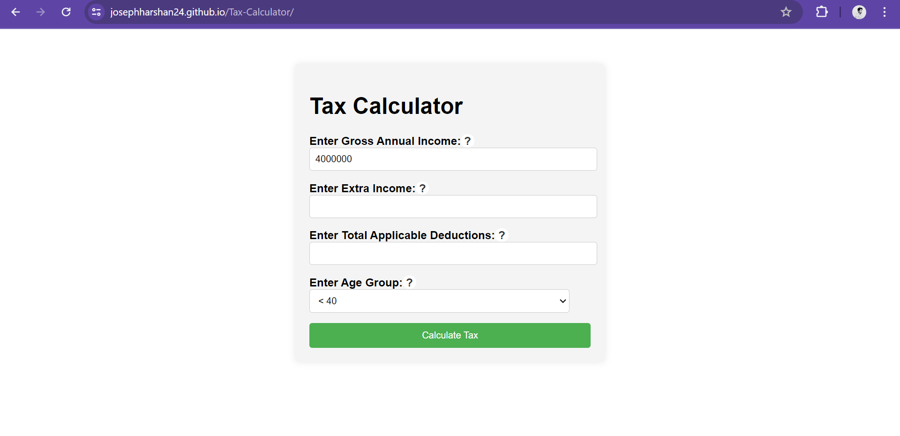
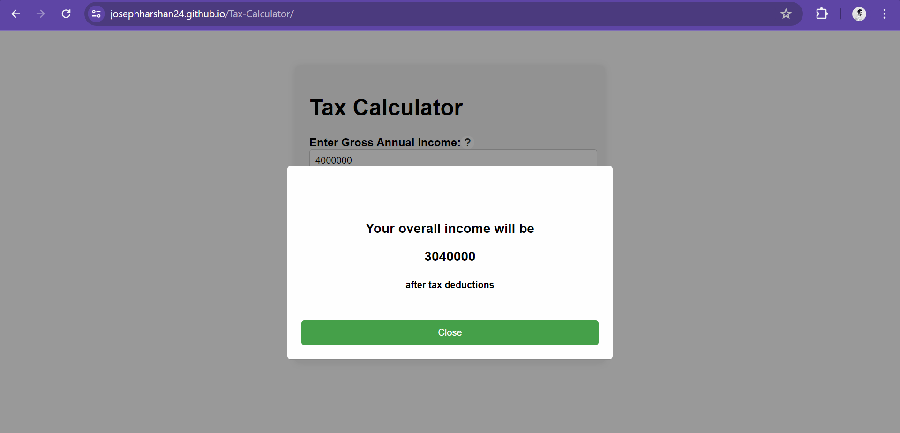

# Tax Calculator

This is a simple tax calculator web application.

## How to Run

1. Clone this repository to your local machine:

    ```bash
    git clone https://github.com/josephharshan24/Tax-Calculator.git
    ```

2. Open the project directory:
   ```bash
   cd tax-calculator
   ```
3. Open the `TaxCalc.html` file in your web browser.
   
## Features

- Calculate tax based on income, extra income, deductions, and age group.
- Display tax calculation results in a modal window.

## Contributing

Contributions are welcome! If you'd like to contribute, please fork this repository and create a pull request with your changes. Be sure to follow our [contribution guidelines](CONTRIBUTING.md).

## Test Cases 
1.Hovering over (?)symbol show the detail about the heading in tooltip 
2.If we dont enter the gross anual income the calculation won't proceed  
3.If we dont enter the age group also it won't proceed to the calculation
4.If we enter anything other than numeric values error appears with tooltip while hovering(!)
5.The age dropdown field has 3 values 
6.If we enter the input given as in the image no error will be available by default
7.The result for the tax calculation will  appear like this


